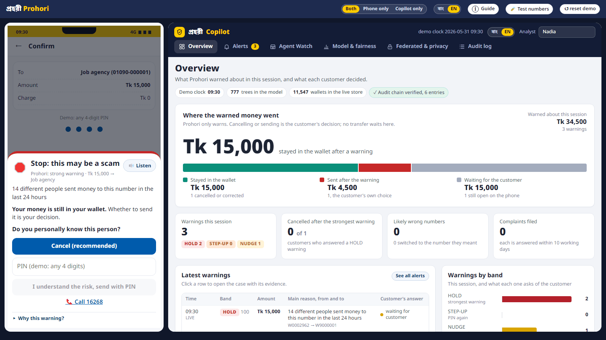
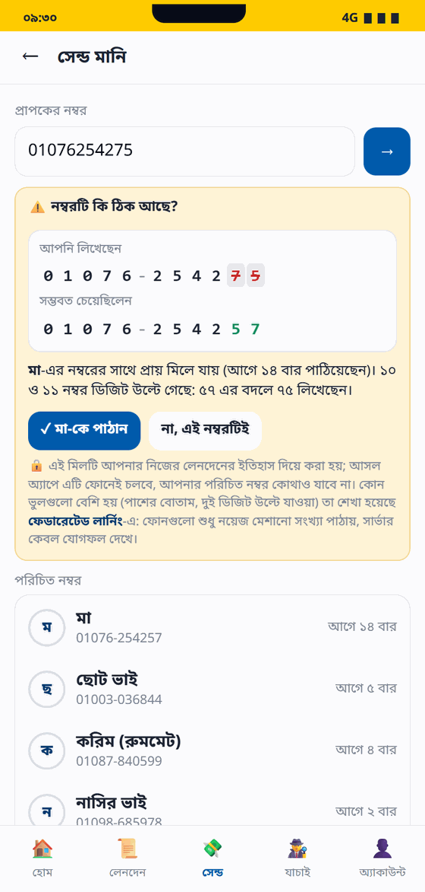
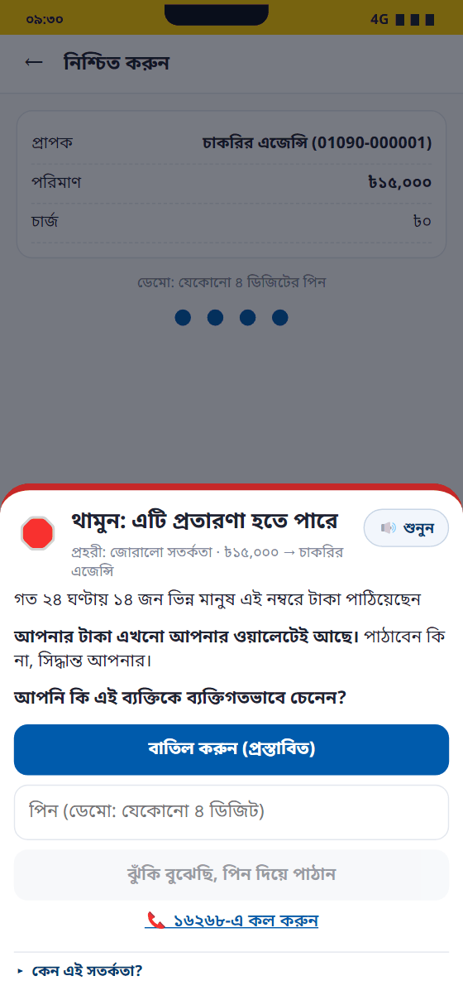
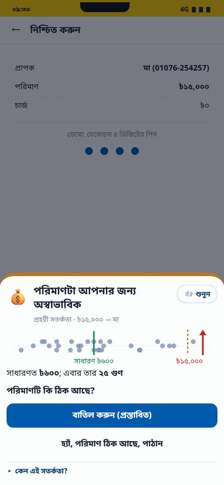
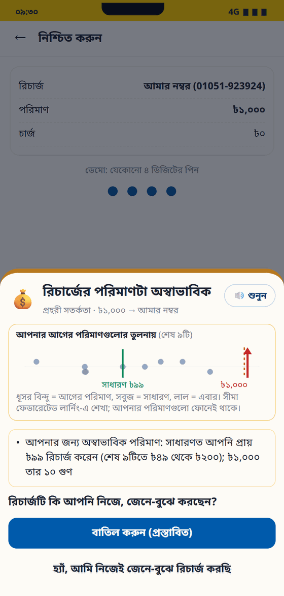
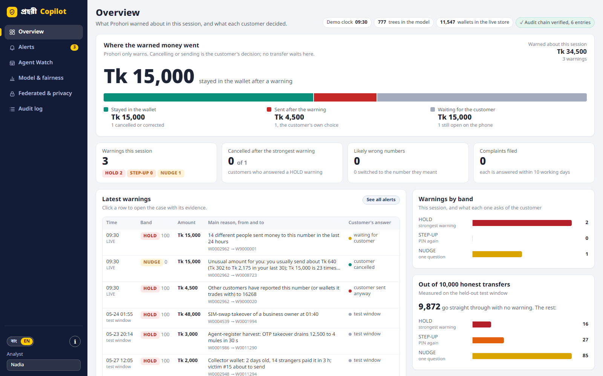
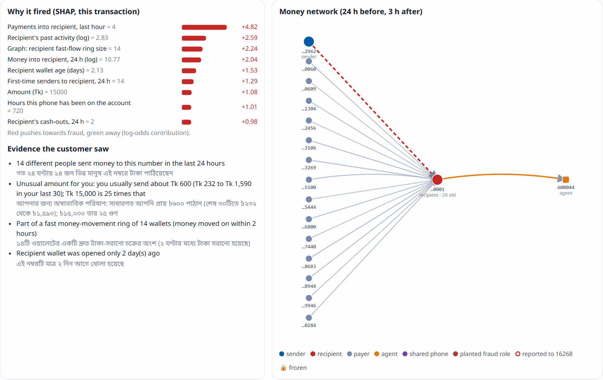
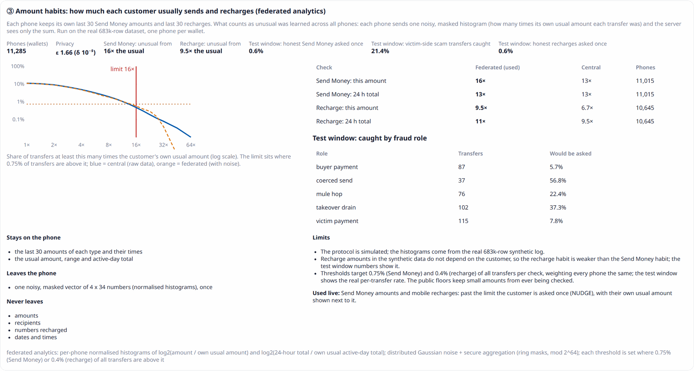

<div align="center">

# প্রহরী Prohori

### Stops the wrong number and the scam before the money leaves an upay wallet

[](https://tariq15-prohori.static.hf.space)


[](https://github.com/Tariq-15/DIUAI_Hackathon_2026/actions/workflows/ci.yml)

[](LICENSE)

**[Open the live demo](https://tariq15-prohori.static.hf.space)** · [Test numbers](docs/test_numbers.md) · [Results](#results) · [Setup](#installation-and-setup) · [API](#api-reference)

AI Hackathon 2026 (DIU CPC × upay) · Track 01: Trust & Risk Intelligence, with our Track 06 work merged in<br>
**Prototype on synthetic data. Not an upay product; the wallet screens are an upay-style mock.**



</div>

## Contents

The rulebook (§6.2) asks for ten items in the README. Each one has its own section:

| Rulebook item | Section |
|---|---|
| Project overview | [Project overview](#project-overview) |
| Features (and how the AI is used) | [Features](#features) |
| Technology stack | [Technology stack](#technology-stack) |
| Requirements | [Requirements](#requirements) |
| Installation and setup | [Installation and setup](#installation-and-setup) |
| Environment variables | [Environment variables](#environment-variables) |
| Run and build commands | [Run and build](#run-and-build) |
| Live deployment URL | [Live demo](#live-demo) |
| Testing instructions | [Testing](#testing) |
| Other configuration | [Other configuration](#other-configuration) |

Also: [Results](#results) · [How it works in depth](#how-it-works-in-depth) · [Disclosures](#disclosures) · [License](#license)

---

## Project overview

**The problem.** Money leaves an upay wallet the wrong way in two everyday ways:

- **A wrong number.** Two digits swapped on the keypad and Tk 800 goes to a stranger. Under upay's terms (§11.1) the
  sender is liable for the number entered.
- **A scam.** "I'm calling from the upay office, tell me the OTP", a job deposit, a fake online seller, a SIM swap at
  1:40 am. Scam money is moved on and cashed out within minutes.

After the money has gone, a complaint can only ask the recipient to give it back: a return needs their consent or a
legal process.

**The solution.** Prohori checks **before the money leaves**, and helps get it back when it already has. It follows
the three layers of the Track 01 brief:

1. **Guardian on the phone:** checks the number as it is typed, and every Send Money and recharge after the PIN.
2. **Detection engine:** trained models on a streaming feature store score each transfer live.
3. **Copilot for upay's analysts:** the evidence, the money network and a case report, for follow-up after the
   warning. No transfer waits for an analyst.

**The purpose.** Protect the customer without getting in their way (98.72% of honest transactions see no friction),
explain every warning in plain Bangla or English, and leave the decision with the customer: Prohori warns, it never
holds a transfer. **Models score, rules warn, the customer decides.**

## Live demo

**https://tariq15-prohori.static.hf.space**

- The trained models run **inside your browser** (Pyodide / WebAssembly): no server, and nothing you type leaves
  your device. The first visit downloads about 30 MB and starts in about 15 s; a refresh downloads nothing and starts
  in about 7 s from the device ([why](#deployment-and-caching)).
- The page shows the upay-style phone and the analyst copilot side by side. **Both | Phone only | Copilot only**
  switches the layout without reloading; **বাং | EN** switches the language on both screens; **ⓘ Guide** lists the
  demo steps; **↺ reset demo** restages the demo world.
- Works on a laptop and on a phone (390 px). `app.html` (phone only) and `analyst.html` (copilot only) also open on
  their own; in separate tabs they share one engine where the browser supports SharedWorker.

**No dataset needed: use the test numbers.** The header button **Test numbers** lists 27 real numbers from the
683,148-row synthetic dataset, grouped by what they are, each with what Prohori answered on a fresh demo; **Try** puts
the number and amount on the phone. The same list is on the phone (Send Money and Recharge) and in
[`docs/test_numbers.md`](docs/test_numbers.md). Start with these:

| # | Do this on the phone (customer Rahim) | You should see |
|---|---|---|
| 1 | Send Tk 800 to Mother (saved contact) | **ALLOW**, sent |
| 2 | Type `01076254275` (Mother's number with the last two digits swapped) | "Did you mean Mother?" with digits 10 and 11 marked, before the amount |
| 3 | Send **Tk 15,000** to Mother | **NUDGE**: "25 times what you usually send", his last 30 amounts drawn beside it |
| 4 | Send Tk 15,000 to `01090000001` ("job deposit") | **HOLD**, the strongest warning: 14 different people paid this number in 24 hours. Cancel, or send anyway with the PIN: the choice is the customer's |
| 5 | Recharge your own number **Tk 1,000** | **NUDGE**: 10 times his usual Tk 99 recharge |
| 6 | Account → customer Salma → "takeover test" scenario | **HOLD**: new phone after a SIM swap |
| 7 | Send Tk 800 to the swapped number anyway (step 2, then "No, this number is right"), then Report a problem: *"Bhai ajke bhul kore 800 taka onno number e chole gese, number er sesh 4 digit 4275"* | the copilot opens a case: matched transfer, genuine wrong send, hold capped at the wallet's balance |

Every warning also appears on the copilot's **Overview** on the right within a few seconds: the bar at the top shows
how much of the warned money stayed in the wallet, was sent anyway, or is still waiting for the customer. Click the
row to open the case with its evidence.

## Features

<table>
<tr>
<td align="center" width="25%"><br><b>Wrong number</b><br>caught while typing</td>
<td align="center" width="25%"><br><b>HOLD</b><br>strongest warning before it moves</td>
<td align="center" width="25%"><br><b>Unusual for you</b><br>25× the usual amount</td>
<td align="center" width="25%"><br><b>Recharge</b><br>10× the usual recharge</td>
</tr>
</table>

| Feature | What the person sees | How the AI is used |
|---|---|---|
| **Wrong-number check** | As the number is typed: known contact, new number, no wallet, or "আপনি কি মা-কে পাঠাতে চেয়েছিলেন?" with the wrong digits marked; one tap sends to the number meant | Keypad-aware Damerau–Levenshtein distance to the contacts the customer pays often; which slips are common was **learned with federated learning** on phones |
| **Scam check before the money moves** | After the PIN, four bands: **ALLOW** goes through, **NUDGE** asks one question, **STEP-UP** asks for the PIN again, **HOLD** is the strongest warning ("your money is still in your wallet", cancel recommended, the PIN again to send anyway). Prohori never holds a transfer: the customer always decides. The screen stays short: the title, the main reason and the choice; every other reason sits under **Why this warning?** 🔊 reads it aloud | **LightGBM** + **Isolation Forest** + money-network **graph rules** on 73 streaming features, fused into a 0–100 score; **SHAP** picks the reasons; a plain-code policy picks the band |
| **Amount habit (Send Money and recharge)** | "You usually send about Tk 600 (Tk 232 to 1,590), about 4 a week"; past the customer's own limit Prohori asks once and draws the last 30 amounts beside this one | Each phone keeps its own last 30 amounts; what counts as unusual (16× for Send Money, 9.5× for recharge) was **learned with federated analytics** across 11,285 phones |
| **Mobile Recharge** | Own number or a contact; a Tk 1,000 recharge or three quick recharges to other people's numbers get one check | The recharge habit plus a rapid-recharge rule (the fraud model is not trained on recharges) |
| **Report a problem (Banglish)** | Write in Bangla, Banglish or English; the app shows what it understood, matches the transfer and tracks the case (10 working days) | Transparent **rules**, not a language model: amounts, last four digits, day and time words, transfer matching |
| **Analyst copilot** | An **Overview** dashboard (where the warned money went, what customers decided, warnings by band, the held-out test window), then a live queue with filters, SHAP evidence, the money network, the amount habit, the customer's own words, a four-part case report, follow-up actions that need a name, audit log | Template report built only from the evidence; optional **Claude** rewording (off by default, numbers checked against the evidence) |
| **Agent Watch** | Rogue cash-out agents, per area, per day | Peer z-scores and a Poisson test for register harvesting (only 9 rogue agents: too few to train on) |
| **Federated & privacy tab** | The three federated results, with what leaves a phone and what never does | Secure aggregation (masks that cancel in the sum) + differential privacy; a **federated GBDT** across 8 divisions exported as a LightGBM model |
| **Am I talking to a scammer?** | Paste what a caller said; Prohori names the known tricks | Rule-based cue check; the text is not stored |
| **Test numbers** | 27 real numbers from the dataset to try, with the expected answer | Each answer recorded by running the same code on a freshly staged demo |

<table>
<tr>
<td colspan="2"><br><b>Copilot overview:</b> where the warned money went, what customers decided, and the held-out test window</td>
</tr>
<tr>
<td width="50%"><br><b>Copilot:</b> why it fired, and where the money went</td>
<td width="50%"><br><b>Copilot:</b> a Banglish complaint matched to the transfer</td>
</tr>
</table>

## Technology stack

| Layer | Used |
|---|---|
| Languages | Python 3.12 · JavaScript (no framework) · HTML/CSS |
| Machine learning | LightGBM 4.7 (main model) · scikit-learn 1.9 (Isolation Forest, isotonic calibration, logistic regression baseline) · XGBoost 3.4 (comparison only) · SHAP 0.52 (TreeSHAP) · Optuna 5.0 (tuning) |
| Data and graphs | pandas 3.0 · NumPy 2.5 · PyArrow 25 · SciPy 1.18 · NetworkX 3.7 · PyYAML |
| Federated learning | Our own implementation: secure aggregation with ring masks (mod 2⁶⁴), Gaussian differential privacy with Rényi accounting, horizontal federated GBDT exported to LightGBM |
| API | FastAPI · Uvicorn · Pydantic |
| Front end | upay-style phone app, analyst copilot and showcase in plain HTML/CSS/JS; Noto Sans Bengali bundled |
| In-browser runtime | Pyodide 0.28.3 (CPython on WebAssembly) in a Web Worker / SharedWorker, with Cache Storage |
| Optional LLM | Anthropic Claude API (`claude-opus-5-5`), only to reword the analyst case report; off by default |
| Deployment | Hugging Face static Space (live) · Docker · Render (`render.yaml`) |
| Testing and CI | pytest 9 · GitHub Actions · Playwright (browser checks, not shipped) |
| Notebooks | Jupyter, runnable on Kaggle or Colab |

## Results

Test window days 51–60, never used for training or tuning, seed 42:

| | Value |
|---|---|
| PR-AUC (rules baseline → Prohori) | 0.188 → **0.962** |
| Fraud caught at a 0.5% false-positive rate (rules → Prohori) | 20.0% → **95.0%** |
| HOLD precision / recall | **86.8% / 91.7%** |
| Honest transactions with no friction | **98.72%** |
| Victim money protected (stated stop-rate assumptions) | **95.1%** (Tk 2,401,775 of Tk 2,526,620) |
| Planted demo scenarios in an acceptable band | **13 / 13** |
| Federated scam model across 8 divisions, PR-AUC | **0.949** (98.7% of central) |
| Amount habit: honest transfers asked once / victim-side scam transfers caught | **0.62%** / **21.4%** |

Synthetic data with injected patterns: read these as upper bounds. Full tables, ablation, fairness and honest notes:

<details>
<summary><b>Full results (seed 42, test window days 51–60)</b></summary>

<!-- RESULTS:START -->
Data: 683,148 transactions, 3,664 fraud (0.54%); validation **14/14 checks pass**.

**Model comparison (test window)**

| Model | PR-AUC | ROC-AUC | Recall @ 0.5% FPR | Recall @ 2% FPR |
|---|---|---|---|---|
| rules baseline | 0.188 | 0.896 | 20.0% | 38.4% |
| logistic regression | 0.899 | 0.997 | 92.4% | 97.0% |
| XGBoost | 0.961 | 0.998 | 95.5% | 98.0% |
| LightGBM | 0.962 | 0.999 | 95.0% | 98.1% |
| Isolation Forest | 0.405 | 0.886 | 39.1% | 52.0% |
| graph rules | 0.142 | 0.788 | 20.1% | 33.8% |
| Prohori fused score | 0.962 | 0.999 | 95.0% | 98.1% |

**Policy operating points (test)**

| Band reached | Alerts | Precision | Recall | False-positive rate |
|---|---|---|---|---|
| NUDGE+ | 1,551 | 46.1% | 97.4% | 1.28% |
| STEP_UP+ | 975 | 71.5% | 95.0% | 0.42% |
| HOLD+ | 775 | 86.8% | 91.7% | 0.16% |

**Recall by scam type (share of fraud transactions at STEP_UP or higher)**

| Scenario | Fraud txns | Cases | NUDGE+ | STEP_UP+ | HOLD | Cases with a STEP_UP+ hit |
|---|---|---|---|---|---|---|
| S1 | 174 | 36 | 100.0% | 100.0% | 98.9% | 100.0% |
| S2 | 151 | 9 | 100.0% | 100.0% | 98.0% | 100.0% |
| S3 | 66 | 11 | 98.5% | 98.5% | 92.4% | 100.0% |
| S5 | 136 | 13 | 88.2% | 77.9% | 74.3% | 100.0% |
| S6 | 70 | 12 | 100.0% | 100.0% | 100.0% | 100.0% |
| S7 | 93 | 34 | 97.8% | 93.5% | 84.9% | 97.1% |
| S8 | 44 | 7 | 100.0% | 100.0% | 95.5% | 100.0% |

**Customer impact and friction**

- Victim-side scam transactions (money leaving a victim) flagged STEP_UP or higher: **90.8%** (NUDGE+ 95.4%).
- Expected victim money protected: **Tk 2,401,775 of Tk 2,526,620 (95.1%)** under the stated stop-rate assumptions.
- Honest customers over the 10 test days: 7.3% saw any warning, 2.6% were asked for a PIN step-up, 0.9% got the strongest (HOLD) warning. Legit transactions allowed without friction: 98.72%.
- Analyst follow-up (after the customer has decided; no transfer waits for it): 77.5 HOLD alerts/day → 258.3 h manual vs 38.8 h with the copilot over 10 days (assumed minutes per case).

**Ablation:** removing a feature group and retraining costs the most PR-AUC for counterparty (−0.137), behaviour (−0.026), complaints (−0.016) (full model 0.962). Component view: LightGBM only 0.962; LightGBM + IsolationForest 0.962; LightGBM + graph rules 0.962; fused (all three) 0.962.

**Fairness:** groups whose false-positive rate exceeds 1.25× the overall rate (≥ 1,000 legit txns): age_band=45-59 (NUDGE ×1.33, STEP_UP ×1.28), age_band=60+ (NUDGE ×1.12, STEP_UP ×1.65), segment=farmer_rural (NUDGE ×1.99, STEP_UP ×2.22), segment=small_business (NUDGE ×1.28, STEP_UP ×1.57), kyc_level=KYC1 (NUDGE ×1.23, STEP_UP ×1.34). These attributes are not model inputs. The gaps come from behaviour that correlates with the group (farmers and older customers transact rarely and in lumps, so a normal transfer looks large against their own history; small-business wallets are paid by many first-time senders). They are monitored in `reports/fairness.csv`, not corrected with per-group thresholds.

**Agent Watch (test):** 6/9 rogue episodes flagged, 1.1 false-alarm agent-days per day across 300 agents. SC-06 agent A00044: score 85.8, 10.4× its area's median cash-out volume. Register-compromise test: 3/4 harvested agents flagged, 1 other.

**Planted demo scenarios:** 13/13 land in an acceptable band.

| ID | Scenario | Expected | Actual | Score |
|---|---|---|---|---|
| SC-01 | SIM-swap takeover of a business owner at 01:40 | HOLD | HOLD | 100.0 |
| SC-02 | Agent-register harvest: OTP takeover drains 12,500 to 4 mules in 30 s | STEP_UP | HOLD | 100.0 |
| SC-03 | Collector wallet: 2 days old, 14 strangers paid it in 3 h; victim #15 about to send | STEP_UP | HOLD | 100.0 |
| SC-04 | Mule chain through a 400-day-old dormant account (hops of 4, 6, 9 min) | STEP_UP | HOLD | 98.0 |
| SC-05 | 'Jail guard' pressure scam: 60+ USSD farmer cashes in 20,000 and sends it | NUDGE | NUDGE | 30.5 |
| SC-06 | Rogue agent: night cash-outs for the ring, ~8-10x peer volume | FLAGGED | FLAGGED | 85.8 |
| SC-07 | Stolen card: 2 x 25,000 Add Money at 03:10, cash-out 29,500 at 03:40 | HOLD | HOLD | 100.0 |
| SC-08 | Fake phone seller: 9 advance payments in 3 days; buyer #1 already reported it to 16268 | NUDGE | HOLD | 88.6 |
| SB-01 | Busy shop owner's personal wallet: 12 payers in a day | ALLOW | ALLOW | 10.6 |
| SB-02 | Legit new phone, then usual bill + 2,000 to mother | ALLOW | ALLOW | 15.3 |
| SB-03 | Rent advance: 35,000 to a new landlord, Friday 11:00, own phone | NUDGE | STEP_UP (established parties cap) | 98.6 |
| SB-04 | Student cashes out 4,900 twelve minutes after parent sends 5,000 | ALLOW | ALLOW | 0.2 |
| SB-05 | Remittance family cashes out 29,500 twenty minutes after 48,250 lands | ALLOW | ALLOW | 2.4 |

Validation (days 46–50) fused PR-AUC 0.967; LightGBM 777 trees; fusion weights {'clf': 1.0, 'anom': 0.0, 'graph': 0.0}. Full detail: `reports/evaluation.md`, `reports/model_card.md`.
<!-- RESULTS:END -->

> These numbers come from synthetic data with injected patterns: read them as upper bounds. The defensible
> claims are the gap over the rules baseline, recall by scam type, the friction numbers, and the fact that
> every number is reproducible with one command.
>
> Honest notes for Q&A:
> - **Fusion weights are fitted on validation, and on this data they put all the weight on LightGBM.** The graph
>   signals already enter LightGBM as features, and adding the Isolation Forest or graph rules on top did not
>   raise validation recall. Both still earn their place: graph patterns drive reason codes and the
>   reported-recipient floor, and the Isolation Forest is reported as an unsupervised alarm for attacks with no
>   labels yet.
> - **The weakest cases are the social-engineering ones on the victim's own phone (S5 fake seller, S7 pressure
>   scam).** They get a NUDGE through the evidence floors rather than a high model score. Re-generating with
>   another seed moves recall on these by a few points.
> - **The federated runs are simulations.** The slip events and phones are synthetic; the cross-silo silos are the
>   8 divisions of the same synthetic world.

</details>

---

## Requirements

| What | Needed for |
|---|---|
| **A modern browser** (Chrome, Edge, Firefox or Safari) and about 30 MB of download on the first visit | the live demo; nothing else |
| **Python 3.12** | running locally (the committed models were built with 3.12; `constraints.txt` pins every version) |
| Git | cloning the repository |
| A laptop CPU; no GPU | everything, including the full pipeline (about 15 minutes, about 3 with `--trials 0`) |
| About 100 MB of disk for the regenerated dataset (`data/generated/`, `data/features/`) | only if you rebuild the data and models |
| Docker | optional: the server image |
| A Hugging Face account and a token with write access | optional: deploying your own copy of the live demo |
| An Anthropic API key | optional: the Claude rewording of case reports (off by default) |

Windows, macOS and Linux all work. The demo needs no account, no API key and no internet once loaded.

## Installation and setup

The repository ships the trained models, the demo state and the portable export in `artifacts/`, so the app runs
straight after installing the dependencies. Rebuilding the data and models is optional.

```bash
# 1. get the code
git clone https://github.com/Tariq-15/DIUAI_Hackathon_2026.git
cd DIUAI_Hackathon_2026

# 2. a virtual environment with Python 3.12
python -m venv .venv
.venv\Scripts\activate            # Windows (PowerShell or cmd)
source .venv/bin/activate         # macOS / Linux

# 3. the dependencies, at the exact versions the committed models were built with
pip install -r requirements.txt -c constraints.txt

# 4. run it: API + phone app + analyst copilot on the committed models
uvicorn src.serve.api:app --port 8000      # open http://localhost:8000
```

Optional: rebuild everything from scratch (data, validation, features, training, evaluation, demo world):

```bash
python -m src.pipeline                      # about 15 min; Optuna 30 trials
python -m src.fl.ondevice                   # federated: keypad-slip costs on (simulated) phones, about 1 s
python -m src.fl.amounts                    # federated: what an unusual amount is, from the 683k rows, about 1 min
python -m src.fl.fedgbdt                    # federated: the scam model across 8 divisions, about 8 min
python -m src.serve.portable                # portable models + staged world + the test numbers
```

## Environment variables

None are required: the demo and the API run with the defaults. Never commit real keys; set them in your shell or in
the host's secret settings.

| Variable | Default | Purpose |
|---|---|---|
| `PROHORI_LLM` | `offline` | `anthropic` lets Claude reword the analyst case report (needs `ANTHROPIC_API_KEY`) |
| `ANTHROPIC_API_KEY` | not set | only with `PROHORI_LLM=anthropic`; example: `ANTHROPIC_API_KEY=<your-anthropic-key>` |
| `PROHORI_SCORER` | `central` | `federated` serves the federated GBDT (`artifacts/fed_serve_bundle.joblib`) instead of the central LightGBM |
| `PROHORI_ARTIFACTS` | `./artifacts` | folder with the trained artifacts |
| `PROHORI_PRELOAD` | `1` | `0` skips building the demo world at start-up (used by the tests) |
| `PROHORI_THREADS` | `4` | worker threads for the API |
| `PORT` | `8000` | port in the Docker image (Render and most hosts set it) |
| `HF_TOKEN` | not set | only for `tools/deploy_space.py`: a Hugging Face token with write access (or run `hf auth login`) |

```bash
# Windows PowerShell
$env:PROHORI_SCORER = "federated"; uvicorn src.serve.api:app --port 8000
# macOS / Linux
PROHORI_LLM=anthropic ANTHROPIC_API_KEY=<your-anthropic-key> uvicorn src.serve.api:app --port 8000
```

## Run and build

| Task | Command | Then |
|---|---|---|
| Run the app (server) | `uvicorn src.serve.api:app --port 8000` | http://localhost:8000 (showcase), `/ui/app.html` (phone), `/ui/analyst.html` (copilot), `/docs` (API), `/health` |
| Build the in-browser site | `python -m src.serve.portable` then `python tools/build_static.py` | `site/`; try it with `python -m http.server -d site 8080` |
| Deploy the live demo | `python tools/deploy_space.py --space USER/prohori --static` | `https://user-prohori.static.hf.space` |
| Run in Docker | `docker build -t prohori . && docker run -p 8000:8000 prohori` | http://localhost:8000 |
| Rebuild data and models | `python -m src.pipeline` (`--trials 0` fast, `--scale 0.1 --out-root runs/small` small) | `data/`, `artifacts/`, `reports/` |

<details>
<summary><b>Every pipeline stage on its own</b></summary>

| Stage | Command | Output |
|---|---|---|
| Generate | `python -m src.datagen.generate [--scale 0.1] [--csv]` | `data/generated/*.parquet`, `data/sample/*.csv` |
| Validate | `python -m src.validation.run_checks [--skip-repro]` | `reports/data_validation.{md,json}` (exit 1 on failure) |
| Features | `python -m src.features.build` | `data/features/features.parquet` |
| Train | `python -m src.models.train [--trials 30]` | `artifacts/model_bundle.joblib`, `reports/metrics_val.json` |
| Agent Watch | `python -m src.agents.agent_watch` | `reports/agent_watch.json`, `data/features/agent_scores.parquet` |
| Evaluate | `python -m src.models.evaluate [--no-ablation]` | `reports/evaluation.md`, `metrics_test.json`, `model_card.md`, `fairness.csv`, `demo_scenarios.md`, `figures/` |
| Export | `python -m src.serve.export_state` | `artifacts/demo_state.joblib` (few MB, for deployment) |
| Demo world | `python -m src.serve.demo_world` | `artifacts/demo_world.joblib`: recent edges, historical alerts with networks, demo customers |
| FL on-device | `python -m src.fl.ondevice` | `artifacts/portable/slip_costs.json`, `reports/federated_ondevice.json` |
| FL cross-silo | `python -m src.fl.fedgbdt [--trees 1500]` | `artifacts/fed_serve_bundle.joblib`, `reports/federated_crosssilo.json` |
| FL amount habits | `python -m src.fl.amounts` (needs `data/generated/`) | `artifacts/portable/amount_habits.json` + `amount_profiles.npz`, `reports/federated_amounts.json` |
| Portable / static | `python -m src.serve.portable` · `python tools/build_static.py` | `artifacts/portable/` (incl. `federated.json`, `test_kit.json`) · `site/` |
| Test numbers | `python -m src.serve.testkit` (also run by the portable export) | `artifacts/portable/test_kit.json`, `data/sample/test_numbers.csv`, `docs/test_numbers.md` |

**Kaggle / Colab:** open `notebooks/00_kaggle_end_to_end.ipynb`, add this repo as a Kaggle Dataset (or set
`REPO_URL`), run all. Save `data/generated/` as a private Kaggle Dataset if you want to reuse it. Notebooks
01–06 walk through each stage with tables and charts and are committed with outputs.

</details>

## Testing

**Automated tests.** 58 tests, a few minutes, on the committed models plus a tiny generated world:

```bash
pytest
```

They cover data invariants, leakage (deleting the future changes no feature), the policy and reason codes, a mini
training run, the product layer through the API, the wrong-number check, complaints, the federated runs, the amount
habit, recharge, and that every test number still answers as recorded. GitHub Actions runs them on every push, plus
the static build and the Ferot archive's tests.

**By hand.** Follow the table in [Live demo](#live-demo) (or `docs/test_numbers.md`), on the live site or on
http://localhost:8000. Every answer there was recorded on a freshly staged demo; press **↺ reset demo** to get back to it.

**Through the API** (server running on port 8000):

```bash
curl localhost:8000/health
curl -X POST localhost:8000/api/v1/risk-score -H "content-type: application/json" \
     -d '{"customer":"rahim","to":"01090000001","amount":15000}'      # band HOLD, with the reasons
curl -X POST localhost:8000/api/v1/recharge -H "content-type: application/json" \
     -d '{"customer":"rahim","number":"01051923924","amount":1000}'   # band NUDGE, unusual recharge
```

## Other configuration

- **`config.yaml`:** every synthetic assumption: seed 42, KYC limits, fees, population, fraud volumes, the time split,
  model and policy settings. The assumptions that matter most are listed in [Assumptions](#assumptions).
- **`artifacts/`** (committed): the trained models, the demo state and world, the federated bundle and
  `artifacts/portable/` (the in-browser models, slip costs, amount habits and test numbers). The app needs these and
  nothing else; never the dataset.
- **`data/`:** `data/sample/` (about 20k rows and the entity tables) is committed; `data/generated/` and
  `data/features/` are rebuilt by the pipeline and git-ignored.
- **Deployment files:** `Dockerfile` and `.dockerignore` (server image), `render.yaml` (Render, Standard plan),
  `requirements-serve.txt` (pinned serving dependencies), `tools/deploy_space.py` (Hugging Face).
- **No accounts, keys or network access** are needed to run or test the demo. The UI loads no external scripts,
  styles or fonts in server mode; the in-browser build loads Pyodide from the jsDelivr CDN.
- **`archive/ferot/`** has its own setup: see its README.

---

## How it works in depth

<details>
<summary><b>What is in this repository</b></summary>

| Path | What |
|---|---|
| `/` (root) | **Prohori, the merged project**: data generator, feature store, models, evaluation, federated learning, risk API, upay-style app, analyst copilot, static in-browser build |
| `archive/ferot/` | **Ferot**, our Track 06 prototype (wrong-send and dispute copilot). Its two best ideas, the keypad-slip "Did you mean…?" check and the Banglish complaint reader, now live in Prohori (`src/serve/recipient.py`, `src/serve/complaints.py`). The original, with its React agent console, 121 tests and the team's upay-style app clone (`archive/ferot/upay frontend clone/`), still runs from that folder |
| `docs/prohori-plan.md` | the team's implementation plan for Prohori |

```
config.yaml                 every synthetic assumption, limits, fraud volumes, model + policy settings (seed 42)
src/datagen/                world.py (entities) · normal.py (normal life) · engine.py (ledger) · fraud.py (S1-S8) · planted.py (SC/SB) · generate.py
src/validation/             checks.py (T1-T14) · run_checks.py
src/features/               store.py (streaming store) · graph.py (hourly graph) · spec.py (feature groups) · build.py
src/models/                 train.py · baselines.py · fusion.py (policy) · scoring.py · explain.py (SHAP -> Bangla/English reasons) · evaluate.py · metrics.py · plots.py
src/agents/agent_watch.py   rogue-agent peer z-scores + register-compromise test
src/fl/                     ondevice.py (slip costs, secure aggregation, DP) · amounts.py (amount habits, federated analytics) · fedgbdt.py (federated trees across 8 divisions) · summary.py
src/serve/                  scorer.py (online engine) · live.py (live world, alerts, complaints, recharge, audit) · recipient.py (wrong-number check) · habits.py (amount habits) ·
                            complaints.py (Banglish complaint reader, transfer matching, SLA) · copilot.py (case reports) · scamcheck.py ·
                            testkit.py (judges' test numbers) · api.py · browser.py (same routes inside the browser) · portable.py · demo_world.py · export_state.py
ui/                         index.html (showcase) · app.html/app.js (upay-style customer app) · analyst.html/analyst.js (copilot) ·
                            prohori.css/js (Bangla/English switch, shared helpers) · fonts/ (Noto Sans Bengali) · engine.js/pyworker.js (in-browser engine)
src/pipeline.py             one-command runner
tests/                      pytest: data invariants, leakage, policy, reason codes, mini training, product layer, wrong-number check, complaints, federated learning, amount habits, recharge, test numbers
tools/                      build_static.py · deploy_space.py · readme_results.py · build_report_pdf.py
notebooks/                  00 Kaggle end-to-end · 01 data · 02 features · 03 training · 04 test evaluation · 05 Agent Watch · 06 inference
docs/                       test_numbers.md · images/ · data_dictionary.md · spec_review_fixes.md · prohori-plan.md · Prohori_Work_Breakdown.pdf
data/sample/                ~20k-row sample (2 test days) + entity tables + test_numbers.csv, committed
artifacts/, reports/        trained bundle, federated bundle, demo state, demo world, portable models; all metrics and figures from the seed-42 run
archive/ferot/              Track 06 prototype (see above)
```

</details>

<details>
<summary><b>The product, layer by layer</b></summary>

| Layer | Where | What it does |
|---|---|---|
| 1. Pre-Transaction Guardian | `ui/app.html`, upay-style phone | **As the number is typed:** known contact ✓, new number, no wallet, or "Did you mean মা (01076-254257)?" with the wrong digits marked. **After the PIN:** Prohori scores the transfer. **ALLOW** goes through. **NUDGE** asks a question with the evidence and a cancel default (for a likely slip: "Send to মা instead"). **STEP_UP** asks for the PIN again. **HOLD** is the strongest warning ("your money is still in your wallet"): cancel is recommended, the PIN again sends it anyway; no transfer is held for an analyst. 🔊 reads the warning aloud (the browser's own voice, no network). **Amount habit:** the amount screen shows "you usually send about Tk 600 (Tk 232 to 1,590), about 4 a week" and warns as you type when an amount is past the customer's own limit; the warning shows the last 30 amounts as dots with this one in red. **Mobile Recharge** with the same habit check and a rapid-recharge rule. Also: **Report a problem** (Banglish complaints, consent never pre-ticked, case tracker), an "Am I talking to a scammer?" checker, and **test numbers** from the dataset under Send Money and Recharge |
| 2. Detection engine | `src/serve/live.py` + the trained bundle | The same streaming feature store, LightGBM, Isolation Forest, graph rules and four-band policy used in evaluation, plus the keypad-slip check with federated costs. Nothing is pre-recorded: every transfer is scored when it is sent |
| 3. Investigation copilot | `ui/analyst.html` | **Overview** (opens first): how much of the warned money stayed in the wallet, was sent anyway or is still waiting; warnings by band; the latest warnings; and the held-out test window (scam types caught, warnings per day, what 10,000 honest transfers see). Then the live queue (pre-send alerts, complaints and recharges; filters for complaints, wrong numbers, unusual amounts and recharges), SHAP evidence, the money network, the digit diff for wrong numbers, the customer's **amount habit** (usual amount, range, how often, this amount against the learned limit), the customer's own words for complaints, a four-part case report, actions that need an analyst's name. Tabs: Agent Watch, model and fairness, **federated learning and privacy** (slip costs, amount habits, cross-silo model), hash-chained audit log |

`ui/index.html` shows the phone and the copilot side by side under a one-line header. **Both | Phone only |
Copilot only** switches the layout on the same page: nothing reloads, so the engine and everything done so far stay
(on a phone it shows one screen at a time). **ⓘ Guide** holds the demo steps, the principle and the prototype note.
On the phone, warnings stay short and explanations open on demand (**Why this warning?**, **What is this?**, ⓘ). `index.html#phone` and `#copilot` open straight in that
layout. **↺ reset demo** restages the world and restarts both screens in place. The **বাং | EN** switch changes both
screens at once, and the language carries over when you open `app.html` or `analyst.html` on their own.

</details>

<details>
<summary><b>The live demo world and the demo transfers</b></summary>

The API loads the feature store replayed to the end of the 60 days and moves the clock to 09:30 the next morning. It
then *stages* scenarios as ordinary synthetic events in the same store the model reads:
- a collector wallet opened 2 days ago, paid by 14 strangers in the last 3 hours, part cashed out at agent A00044
  (the SC-06 rogue agent);
- a SIM-swap takeover of Salma's account (SIM replaced, a "gang phone" linked to three young wallets logs in,
  PIN reset);
- a fake online seller paid by six first-time buyers, one of whom already reported it to 16268;
- a stranger's wallet whose number is Rahim's mother's number with the last two digits swapped.

Then the real model scores whatever the app sends:

| Demo transfer | Band (live) | Main evidence shown to the customer |
|---|---|---|
| Rahim → his mother, Tk 800 | ALLOW | (none) |
| Rahim → his mother's number with two digits swapped, Tk 800 | NUDGE (`possible_wrong_recipient`) | "Did you mean মা (01076254257)? You have sent there 14 times; digits 10 and 11 are swapped: you typed 75 instead of 57" + one-tap "Send to মা" |
| Rahim → his mother, **Tk 15,000** (model alone: ALLOW, score 0) | NUDGE (`unusual_amount`) | "Unusual amount for you: you usually send about Tk 600 (Tk 232 to Tk 1,590 in your last 30); Tk 15,000 is 25 times that" + his last 30 amounts drawn next to this one |
| Rahim recharges his own number Tk 1,000 (he usually recharges about Tk 99) | NUDGE (recharge habit) | "you usually recharge about Tk 99 …; Tk 1,000 is 10 times that". Tk 50 goes straight through |
| Rahim recharges three different numbers Tk 100 each within an hour | third one NUDGE (`recharge_burst`) | "Recharge number 3 in the last hour, to 2 numbers that are not yours: scammers ask victims to recharge the scammers' own numbers" |
| Rahim → a new number someone gave him, Tk 6,000 (found by rule: an ordinary wallet the model puts in NUDGE/STEP_UP) | NUDGE | amount vs his largest, first transfer to the number |
| Rahim → collector, Tk 15,000 ("job deposit") | HOLD 100 | 14 different people paid this number in 24 h; fast money-movement ring; opened 2 days ago |
| Rahim → fake seller, Tk 4,500 | HOLD | reported to 16268; opened 20 days ago; 6 different payers |
| Salma's account from the gang phone, Tk 50,000 | HOLD 100 | new phone 0.7 h ago; recipient 9 days old; 2.1× her largest transfer |

If Rahim sends to the swapped number anyway, "Report a problem" with *"Bhai ajke bhul kore 800 taka onno number e
chole gese, number er sesh 4 digit 4275"* reads amount Tk 800, number ending 4275, today; matches transfer TL-xxxx
(confidence 0.94); types the case **genuine wrong send (keypad slip)**; recommends **hold the disputed amount**
(capped at what the receiving wallet still holds) and **ask the recipient for consent**; and sets the deadline 10
working days ahead (Friday and Saturday excluded). A scam complaint is typed **likely scam victim** instead.

The analyst queue also holds the planted test-window cases (SC-01 to SC-08, SB look-alikes) and the final test
day's STEP_UP/HOLD alerts, re-scored by the bundle with their real money networks. It includes false alarms,
labelled with the synthetic ground truth so judges can see both kinds.

</details>

<details>
<summary><b>Rules that keep people in control</b></summary>

Plain code, `src/serve/live.py` and `copilot.py`:
- Prohori only warns. The customer cancels or confirms every warning: one tap for a NUDGE, the PIN again for
  STEP_UP and HOLD. HOLD is the name of the top score band (80 and above), not a hold: no transfer waits for an
  analyst. A likely keypad slip always gets a one-tap check, even when the model says ALLOW.
  So does an amount past the customer's own habit (at least 16 times their usual Send Money amount and at least
  Tk 2,000, or a 24-hour total at least 13 times their usual day and at least Tk 5,000; for recharges 9.5 times and
  Tk 200). These rules only ask; they never block. Recharges are not scored by the model (it was not trained on
  them): they get the habit check and the rapid-recharge rule.
- Recommended follow-up actions come from a fixed list (flag recipient, verify owner, contact senders, review agent,
  watchlist, dismiss, hold disputed amount, ask recipient consent, ask customer details), picked by rules.
  Every action needs an analyst name; a dismissal needs a reason. None of them stops or releases a transfer.
- An analyst's flag becomes policy: any later transfer to that wallet gets the strongest warning
  (`recipient_flagged_by_analyst`), and the customer still decides.
- A complaint needs explicit consent (never pre-ticked). A hold is never more than the disputed amount or what the
  wallet holds. Nothing promises a refund: upay's terms make the sender responsible for the number entered, and a
  return needs the recipient's consent or a legal process. The customer is told how to escalate to Bangladesh Bank.
- Every model alert, customer choice, complaint and analyst action goes into a SHA-256 hash-chained audit log
  (`GET /api/v1/audit` verifies it).
- The case report is a template filled only from structured evidence. Optionally (`PROHORI_LLM=anthropic` +
  `ANTHROPIC_API_KEY`), Claude (`claude-opus-5-5`) may reword it. It sees structured facts only, never a
  customer's own words, and its text is rejected if it contains any number not in the evidence. It is off by
  default, so the demo runs with no internet.
- Complaint text and scam-check text are read by transparent rules, never by a language model.

</details>

<details>
<summary><b id="api-reference">API reference</b></summary>

Stable contract: `POST /api/v1/risk-score`. Interactive docs at `/docs` when the server runs.

| Endpoint | Purpose |
|---|---|
| `POST /api/v1/risk-score` | `{customer \| sender_id, to, amount, device_id?}` → band, score, Bangla/English reasons and message, allowed choices, `suggestion` (the contact probably meant, with the wrong digits), `habit` (the customer's usual amount, this one's ratio, the learned limit) |
| `POST /api/v1/recharge` | `{customer, number, amount}` (Tk 10 to 1,000) → ALLOW (done) or NUDGE (answer with `/decision`); `GET /api/v1/customers/{key}/recharges` lists them |
| `GET /api/v1/test-kit` | the judges' test numbers from the dataset, each with what Prohori answered on a fresh demo |
| `POST /api/v1/recipient-check` | as the number is typed: does a wallet use it, is it a known contact, or one slip from one |
| `POST /api/v1/alerts/{id}/decision` | customer: `cancel` / `confirm` / `confirm_pin` / `use_suggested` |
| `GET /api/v1/transfers/{id}` | customer's view of a warned transfer (status only) |
| `GET /api/v1/customers/{key}/transfers` | the customer's own last 7 days, for "which transfer?" |
| `POST /api/v1/complaints/preview`, `POST /api/v1/complaints`, `GET /api/v1/complaints/{id}` | read the words back; file (consent required); the customer's case status |
| `GET /api/v1/alerts`, `GET /api/v1/alerts/{id}` | queue; case file with SHAP, network, report, trail (`?llm=1` to reword) |
| `POST /api/v1/alerts/{id}/action` | analyst action `{action, analyst, note}` |
| `GET /api/v1/agent-watch`, `/api/v1/model`, `/api/v1/audit` | panels (`/api/v1/model` includes the federated results) |
| `POST /api/v1/scam-check` | "Am I talking to a scammer?" (Bangla and English advice) |
| `GET /api/v1/customers`, `POST /api/v1/demo/reset` | demo customers and scenarios; restage the world |

Plus the original inference routes `POST /v1/score`, `GET /v1/demo`, `/v1/demo/{SC-03}`, `GET /v1/agents/top` and
`GET /v1/metrics`. The in-browser build answers the same `/api/v1` routes through `src/serve/browser.py`.

</details>

<details>
<summary><b>Federated learning: the data stays where it is</b></summary>

All three runs are shown in the copilot's **Federated & privacy** tab. The protocols are simulated; the arithmetic
and the privacy accounting are real.



**① On the phone: which digits people mistype** (`src/fl/ondevice.py`). When a customer taps "Send to মা instead",
the phone records one confirmed slip (digit meant → digit typed, or two digits swapped). Phones never send those
events. Each round, a phone sends one 101-number count vector with its share of Gaussian noise, masked with
pairwise ring masks (integers mod 2⁶⁴), so the server sees only the sum over 1,000 phones. From the sums it learns
how likely each slip is and turns that into the edit costs the wrong-number check uses
(`artifacts/portable/slip_costs.json`).

| | Value |
|---|---|
| Simulated phones | 100,000; 6 rounds, half online each round, at most 2 slips reported per phone per round |
| Privacy | each group sum is (ε, δ) = (**4.25**, 10⁻⁵) differentially private over all 6 rounds (Gaussian mechanism, Rényi accounting) |
| Accuracy | L1 error vs the true slip pattern **0.035**; with the same ε but noise added only on each phone (no trust in the server) **0.626** |
| What it learned | neighbouring key costs 0.61, any other key 0.93 (Ferot's hand-set values were 0.6 and 1.0); swaps 35% of slips (true 35%) |
| Leaves the phone | one noisy, masked vector of 101 counts per round |
| Never leaves | contacts, numbers typed, the slips themselves |

**② Across divisions: the scam model without pooling transactions** (`src/fl/fedgbdt.py`). A horizontal federated
gradient-boosted tree model over 8 division silos: shared quantile sketches for the bins, then per tree level each
silo sends gradient/hessian/count histograms through secure aggregation (ring masks, mod 2⁶⁴); the server picks
splits from the sum only; early stopping on the summed validation loss. The result is written as a LightGBM text
model (largest difference from our own tree walk: 2.8e-14) and runs as a drop-in (`PROHORI_SCORER=federated`).

| Test window (days 51–60) | Central LightGBM (pooled data) | Federated GBDT (8 silos) |
|---|---|---|
| PR-AUC | 0.962 | **0.949** (98.7% of central) |
| ROC-AUC | 0.9985 | 0.9979 |
| Recall at 0.5% FPR | 95.0% | 94.6% |
| HOLD+ precision / recall | 86.8% / 91.7% | 85.0% / 88.0% |
| Planted scenarios in an acceptable band | 12 / 12 | 12 / 12 |

The live demo keeps the central model (higher HOLD recall); the federated one is one setting away. Limits, stated in
the tab too: features come from one feature store that sees all wallets (a real deployment needs privacy-preserving
cross-silo joins for counterparty and graph features); summed histograms are protected by secure aggregation but are
not differentially private; policy thresholds were fitted on the pooled validation window.

**③ Amount habits: how much is unusual for this customer** (`src/fl/amounts.py`, live in `src/serve/habits.py`).
Each phone keeps its own last 30 Send Money amounts and last 30 recharges (with times): its usual amount (median),
its range (middle half), how often, and its usual total on a day it is used. What counts as *unusual* is learned
across phones with federated analytics: each phone turns its own history into two normalised histograms (how many
times its own usual amount each transfer was, and each 24-hour total against its usual day), adds its share of
Gaussian noise and sends them through secure aggregation; the server sets each limit where 0.75% (Send Money) or
0.4% (recharge) of all transfers are above it. No amount, recipient, number or date leaves a phone, and no label is
used (a phone does not know which of its transfers were fraud). Run on the real dataset: one phone per customer
wallet that sends or recharges.

| | Send Money | Mobile recharge |
|---|---|---|
| Phones (wallets) | 11,015 | 10,645 |
| Unusual if this amount ≥ … × the customer's usual (federated · central) | **16×** · 13.5× (and ≥ Tk 2,000) | **9.5×** · 6.7× (and ≥ Tk 200) |
| … or the 24-hour total ≥ … × the usual day | **13.5×** · 13.5× (and ≥ Tk 5,000) | **11.3×** · 9.5× (and ≥ Tk 500) |
| Test window (days 51–60): honest transfers asked once | **0.62%** of 33,933 | **0.61%** of 23,586 |
| Test window: scam transfers caught | 21.4% of 341 victim-side (coerced sends 57%, account-takeover drains 37%, mule hops 22%) | no recharge fraud in the data |
| Privacy | (ε, δ) = (**1.66**, 10⁻⁵) for all four histograms together, one release | |

It is one explainable signal on top of the model, not a replacement: the model already reads the amount against the
sender's history (`amount_z`, `amount_vs_max`). What the habit adds is a check the customer can understand ("25 times
what you usually send") even when the model says ALLOW. Limits: synthetic Send Money amounts are very spread (a
customer's own transfers vary by a factor of about 2.3), so the limits are high; recharge amounts in the synthetic
data barely depend on the customer, so that habit is weaker; the federated limits are one histogram bin from the
central ones because of the noise.

</details>

<details>
<summary><b>The synthetic upay world</b></summary>

60 days, 10,000 base customers (+ legit signups during the window), 300 agents, 600 merchants, 12 billers,
48 areas in 8 divisions. About **680k transactions, 0.5% fraud**. Every row passes through a ledger that
enforces balances and KYC limits, so balances chain exactly and no successful row breaks a cap.

**Normal life:** salaries on days 1–5 (garment workers 5–10) followed by money sent home; Friday/Saturday
rhythm; Eid salami (small round transfers to many contacts); bills mid-month; recharges; cash-in/out at
agents only during shop hours; remittance families cashing out soon after money lands; customers who are
short walk to an agent, cash in, and retry.

**Legit look-alikes (so no single signal is a giveaway):** 14 new wallets a day; shared family and shop phones;
night owls; family "hub" wallets forwarding money within minutes; quick cash-outs after receiving;
f-commerce sellers paid by many first-time buyers; phone changes and SIM replacements followed by bigger
transfers; big one-off transfers to new recipients (rent, hospital); monthly 10–25k bank top-ups.

**Injected fraud, with ground truth on every row:**

| ID | Scenario | Grounding |
|---|---|---|
| S1 | OTP/PIN takeover from a gang phone: login, PIN reset, drain to 1–4 mules. Variants: **agent-register harvesting** (victims visited one of 4 compromised agents; 4 sends in ~30 s to fake-NID mules) and **remote-access app** (on the victim's own phone) | playbook §2.3; TBS register-harvest case |
| S2 | Collector wallet 1–3 days old receives from 8–25 first-time victims in hours (job fee, lottery, parcel, loan fee), then cashes out | playbook §5.2 pattern B |
| S3 | Mule chain: 2–4 hops within minutes, sometimes splitting, 10% gang cut, ending in cash-out | playbook pattern C |
| S4 | Rogue agents (9): episodes of 2–3 days at ~8–10× peer cash-out volume, open at night for the gang | playbook "injected agent risk" |
| S5 | Fake online seller: advance payments from buyers over days, nightly cash-outs, then silence | f-commerce scams |
| S6 | SIM-swap takeover of business owners with high balances: SIM swap, new phone, PIN reset, drain to the daily cap | SIM-swap gang reports |
| S7 | Guided victim / pressure scam (jail guard, lawyer, police, relative in hospital): victim's own phone, often 60+ and USSD, cash-in first, personal recipient wallet cashes out within minutes | pressure-scam reports |
| S8 | Stolen card → Add Money bursts (some rejected by the cap) → cash-out within minutes → wallet silent | card-to-wallet case |

25% of mules are **aged, bought accounts** (some dormant first). New mules are recruited weeks ahead and
warmed up with small normal activity, so "new wallet = fraud" does not work.

**Planted demo scenarios** (all in the test window, unseen by training): SC-01…SC-08 must be caught; SB-01…SB-05
are benign look-alikes that must not be blocked. See `reports/demo_scenarios.md`.

Full column list: `docs/data_dictionary.md`.

</details>

<details>
<summary><b>Validation T1–T14</b></summary>

| | Check | | Check |
|---|---|---|---|
| T1 | schema, keys, time order | T8 | fraud 0.3–0.8%, every scenario in train/val/test, rogue episodes in every split |
| T2 | referential integrity | T9 | label consistency (case, role) |
| T3 | balances chain exactly per wallet, none negative | T10 | scenario signatures (collector age, hop delay, SIM swap before drain, own vs new device, S4 ~8–10×) |
| T4 | no successful row breaks a KYC cap | T11 | anti-shortcut: aged-mule share, fraud not only at night, legit new wallets / phone changes / fan-in exist, no single feature AUC > 0.95 |
| T5 | night trough, evening peak, Eid spike, salary days, Friday | T12 | time-disjoint splits, planted keys in test |
| T6 | volume and type mix | T13 | planted scenario facts (e.g. SC-03: 2-day-old wallet, exactly 14 senders in 3 h) |
| T7 | round-number amounts, heavy tail, valid recharge amounts | T14 | same seed → identical data, different seed → different |

</details>

<details>
<summary><b>Features and models</b></summary>

**Streaming feature store** (`src/features/store.py`): for each transaction, compute from the past, then
update. 62 streaming features in 7 groups plus 11 hourly-graph features:

- **transaction:** amount, hour, channel …
- **behaviour:** amount vs own history, drain ratio, velocity, hour surprise, dormancy …
- **device_session:** new phone, phone age on account, wallets per phone, SIM swap / PIN reset / new-login recency …
- **flow:** pass-through ratio, chain depth, first-time senders received …
- **counterparty:** recipient age, first-time pair, recipient fan-in, recipient phone sharing …
- **agent:** agent cash-out spike, young-wallet share …
- **complaints:** 16268 reports on the recipient and its neighbours
- **graph:** degree, PageRank, fast-flow component size, two-hop fan-in

`tests/test_features.py` deletes the future and checks that no feature value changes.

**Models:**

- **LightGBM**, Optuna-tuned. Compared against XGBoost, logistic regression, a hand-written rules baseline, and PaySim's `isFlaggedFraud` rule.
- **Isolation Forest** on behaviour-deviation features (unsupervised).
- **Graph rules:** collector fan-in, pass-through chain, fast-flow network, reported number, shared device.
- **Wrong-number check** (`src/serve/recipient.py`): keypad-weighted Damerau–Levenshtein distance from the number
  typed to each contact paid at least twice, with federated slip costs; a contact within 1.6 is suggested, frequent
  contacts first. `describe()` names the slip: two neighbouring digits swapped, or one wrong key (and whether it is
  the key next to the right one).

**Decision policy** (`src/models/fusion.py`, plain auditable Python):
`fused = w·[p_fraud, anomaly, graph]` → monotone map to 0–100 → **ALLOW < 30 ≤ NUDGE < 60 ≤ STEP_UP < 80 ≤ HOLD**.

- **Cut-offs:** each cut is the stricter of a false-positive budget (1% / 0.3% / 0.1% of legit transactions) and a precision floor (40% / 70% / 90%), both measured on validation.
- **Established-parties cap:** a HOLD becomes a PIN step-up when only the customer's own behaviour is unusual. That means their own long-used phone, no SIM swap, and a recipient that is an old wallet nobody has reported. The customer decides; nothing is frozen.
- **Likely keypad slip:** an ALLOW becomes a NUDGE with "Send to … instead" (`possible_wrong_recipient`).

**Explanations:** SHAP picks the evidence; templates turn values into English and Bangla, e.g.
"এই নম্বরটি মাত্র ২ দিন আগে খোলা হয়েছে। গত ২৪ ঘণ্টায় ১৪ জন ভিন্ন মানুষ এই নম্বরে টাকা পাঠিয়েছেন।"
The LLM copilot (if enabled) only rewrites this structured evidence and never changes a band.

**Complaints** (`src/serve/complaints.py`, from Ferot): rules for amounts (digits, Bangla digits, words like
"পাঁচশো"), full numbers or the last four digits ("sesh 4 digit 4275"), day and time-of-day words in Bangla, Banglish
and English ("2 ta digit" is a count, not 2 o'clock), transaction IDs and scam cues; then the best-matching transfer
in the customer's last 7 days with a confidence. The case type comes from the slip check and the model's view of the
receiving wallet: genuine wrong send, likely scam victim, needs review, or needs details.

**Agent Watch:** with only 9 rogue agents, supervised ML would learn 9 examples. Agent Watch uses peer
z-scores instead: volume vs area median, night share, young-wallet share, pass-through share, and share already
reported. It is evaluated per episode. A Poisson test flags agents visited by far more complaining victims
than their footfall predicts (register harvesting).

**Time split and data hygiene:** train days 1–40 · validation 41–45 (early stopping, Optuna) · validation 46–50
(fusion weights, calibration, band cut-offs) · **test 51–60, read once by `evaluate`**. No random splits. Protected
attributes (gender, age band, division, urban/rural, segment) are never model inputs; false-positive rates are
audited per group.

</details>

<details>
<summary><b id="deployment-and-caching">Deployment and caching</b></summary>

The API and UI need `artifacts/model_bundle.joblib` (or `serve_bundle.joblib`), `demo_state.joblib` and
`demo_world.joblib` (a few MB) and `ui/`, never the dataset. The UI loads no external scripts, styles or fonts, so the
demo works offline. Bangla text uses **Noto Sans Bengali**, bundled in `ui/fonts/` (variable WOFF2 from Google
Fonts, about 150 KB; SIL Open Font License 1.1, `ui/fonts/OFL.txt`).

```bash
docker build -t prohori . && docker run -p 8000:8000 prohori
curl localhost:8000/health
curl -X POST localhost:8000/v1/score -H "content-type: application/json" -d '{"sender_id":"W0000050","receiver_id":"W0000051","amount":25000,"device_id":"DV9999999"}'
```

**Live deployment (free): a static Hugging Face Space where the models run in the browser.** Docker Spaces now
need Hugging Face PRO, so the free deployment ships no server at all:
- `python -m src.serve.portable` writes the models in version-neutral form (`artifacts/portable/`): LightGBM's own
  text model, the Isolation Forest trees as arrays, the isotonic calibrator as arrays, the rest as JSON, plus the
  federated slip costs and results. It also saves the demo world after staging. On 4,734 test-window transactions
  (all 734 frauds plus 4,000 honest), every probability, score, band, policy override and SHAP contribution is
  identical to the pickled originals. In real Pyodide the largest difference on 1,000 rows is 1e-16.
- `python tools/build_static.py` builds `site/`: the same `ui/` pages, `config.js` in browser mode, and
  `py/prohori-<content hash>.zip` (our Python package plus the portable models, amount habits and test numbers,
  8.1 MB). `ui/pyworker.js` boots Pyodide 0.28 in a Web Worker (numpy, pandas, SciPy and LightGBM from the jsDelivr
  CDN) and answers every `/api/v1` route through `src/serve/browser.py`. The showcase's phone and copilot share one
  engine, so alerts still flow between them; separate tabs (`app.html` in one, `analyst.html` in another) share one
  too, through a SharedWorker, where the browser has it (desktop Chrome, Edge, Firefox, Safari).
- `python tools/deploy_space.py --space USER/prohori --static` uploads it. Measured on the live Space (October 3):
  first visit ready in about 12–15 s, a refresh in about 7.5 s with nothing downloaded; about 100 ms per scored
  transfer. In the browser the 24-hour graph snapshot from 09:30 is kept (networkx is not loaded); training also
  rebuilt it only hourly.

**Caching: why a refresh is fast.** Earlier, every refresh downloaded the model zip again: Hugging Face answers it
with a redirect to a fresh signed URL marked `no-store`, so the browser cache never kept it, and each refresh (or each
switch between phone only and copilot only) restarted everything. Now:
- the zip is named by its content hash and kept in the browser's Cache Storage under that name; Pyodide and its
  packages (versioned CDN URLs) are kept there too. A refresh downloads nothing, and the start-up card says so.
- a new deploy has a new zip name and a new build id (`?v=` on every script and stylesheet), so a stale copy is
  never served; old zips are deleted from the cache.
- scikit-learn (6.3 MB, plus its import time on every start) is no longer loaded: LightGBM only needs it for its
  scikit-learn wrapper, which serving does not use.
- switching Both / Phone only / Copilot only and ↺ reset happen on the page, without a reload.
- the server version sends `Cache-Control: no-cache` for the UI (revalidate with the ETag), fonts for a week.

**Server version on Hugging Face Docker Spaces (needs PRO) or any Docker host.** One command uploads only what the image
needs (Dockerfile, pinned requirements, `config.yaml`, `src/`, `ui/`, three artifacts and the small portable files):

```bash
pip install huggingface_hub
hf auth login                                        # token with WRITE access from huggingface.co/settings/tokens
python tools/deploy_space.py --space YOUR-HF-USERNAME/prohori --source https://github.com/YOUR/REPO   # Docker Space (PRO)
# or, free:  python tools/deploy_space.py --space YOUR-HF-USERNAME/prohori --static
```

`--dry-run` lists the upload without sending anything. Re-running the command redeploys and mirrors the folder.
The script uses the Hub API because a plain `git push` to a Space rejects binary files (`.joblib`, `.woff2`).
Docker Spaces sleep after about 48 hours without visitors; static Spaces do not sleep.

**Measured in Docker (Linux, the image the Space builds):** healthy 12 seconds after start, about 476 MiB right
after start, about 545 MiB after the full demo and a reset. The demo world is built once at start-up, on the main
thread. Building it lazily in a request thread used 200-350 MB more. The serving bundle leaves out the XGBoost and
logistic-regression comparison models; the live policy never uses them, and the image then needs no XGBoost.
`requirements-serve.txt` pins the exact versions the artifacts were pickled with (pandas 3 also needs `pyarrow`).
Set `PROHORI_SCORER=federated` to serve the federated model instead (`artifacts/fed_serve_bundle.joblib`).

**Render:** `render.yaml` works with the same Dockerfile but asks for the Standard plan (2 GB). The Free and
Starter plans have 512 MB, below what the app uses after a demo.

</details>

<details>
<summary><b id="assumptions">Assumptions you may be asked about</b></summary>

Every number is in `config.yaml`. The ones that matter most:

| Assumption | Value | Status |
|---|---|---|
| KYC2 limits | Send Money Tk 50,000/day, Cash Out Tk 30,000/day, Add Money Tk 25,000/txn | 2025 news coverage of BB circulars; **verify upay's current numbers** |
| KYC1 limits | Tk 10,000/day send / cash-out | synthetic assumption |
| Cash-out fee | 1.85% | typical BD MFS, synthetic |
| Fraud prevalence | ~0.5% of transactions | synthetic, chosen for a usable test set |
| Complaint rates | 35–95% of victims call 16268, after 2 h – 5 days | synthetic |
| Stop rates | NUDGE 30%, STEP_UP 70%, HOLD 100% of scams stopped | **assumption** behind the "money protected" estimate |
| Analyst time | 20 min manual vs 3 min with copilot per HOLD | assumption |
| Eid placement | days 9–11 | synthetic placement (not the real 2026 calendar) |
| Complaint deadline | 10 working days, Friday and Saturday excluded | MFS Regulations 2022 §17.3 |
| Keypad-slip suggestion | distance ≤ 1.6, contact paid at least twice | Ferot Guard settings |
| Slip events on phones | 70% neighbouring key, 30% other key, 35% of slips are swaps | **simulation assumption** for the on-device run |
| Recharge limit | Tk 10 to 1,000 per recharge | synthetic assumption |

**Claims to avoid on slides:** the "56% of fraud was compromised PINs/impersonation" figure. In the source
found, 56% was the share of victims whose complaints were resolved satisfactorily, from an Aug–Sep 2021
survey. Check the PRI report before quoting anything from it.

What changed versus the reviewed spec, and why: `docs/spec_review_fixes.md`.

</details>

---

## Disclosures

As required by the rulebook (§4.4, §9.2):
- **AI coding assistance:** this codebase was written with substantial help from Claude Code (Anthropic), working
  with the team. The team reviewed the design and can explain every component.
- **External API (optional, off by default):** Anthropic Claude API, only to reword the analyst case report from
  structured facts. Complaint and scam-check text is read by rules, never sent to an LLM.
- **Open-source libraries:** pandas, NumPy, PyArrow, SciPy, scikit-learn, LightGBM, XGBoost, SHAP, Optuna, NetworkX,
  PyYAML, Matplotlib, FastAPI, Uvicorn, Pyodide (in-browser build), Playwright (testing only, not shipped).
  Font: Noto Sans Bengali (Google Fonts, SIL OFL 1.1). `archive/ferot/` lists its own (React, Vite, Tailwind CSS…).
- **Data:** entirely synthetic, generated by `src/datagen`. No real customer data. Phone numbers use the 010 prefix.
- **Brand:** "upay" is used only to describe who the prototype is for. No upay logo files or assets are used. The
  upay-style screens imitate the look of a wallet app (yellow and blue colours) and are labelled as a prototype on
  synthetic data, not upay's app: in every page title, the **ⓘ Guide** of the showcase and the ⓘ on the phone and the
  copilot.

## License

MIT, see [LICENSE](LICENSE).
