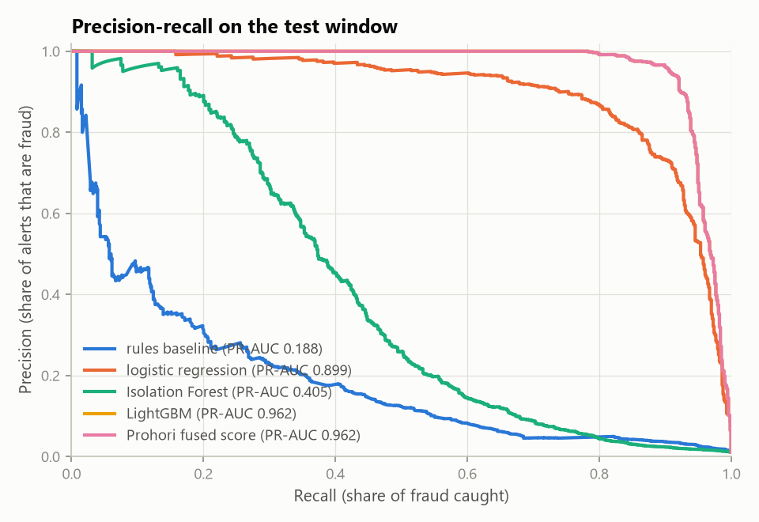
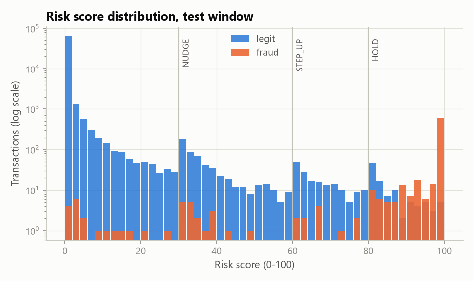
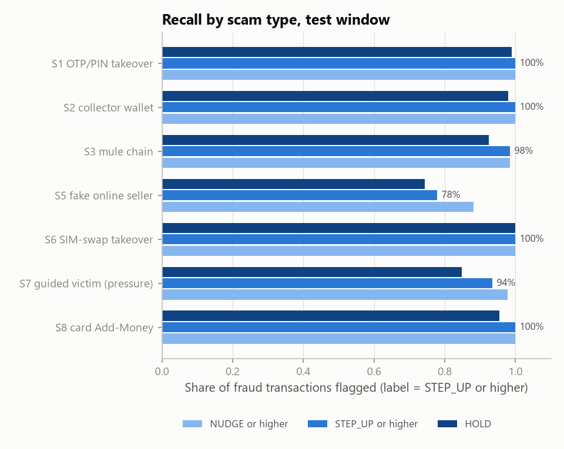
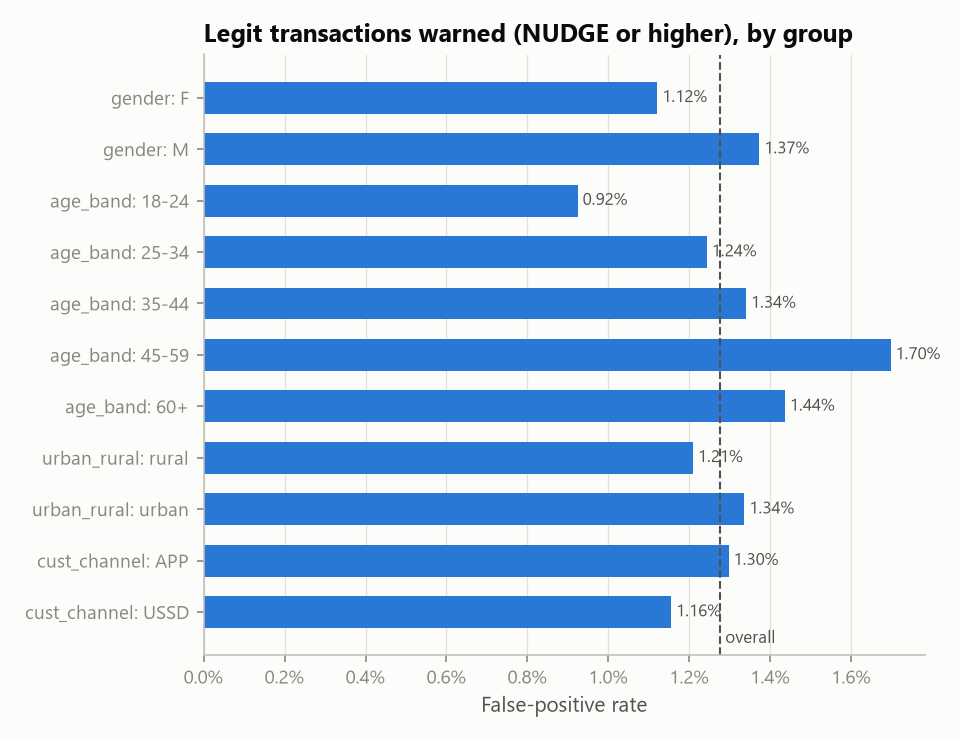
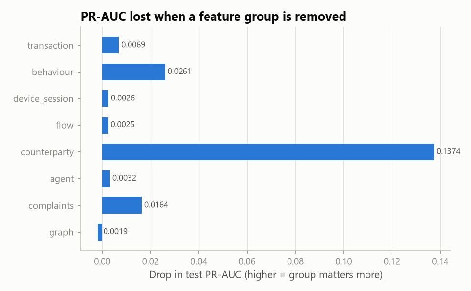
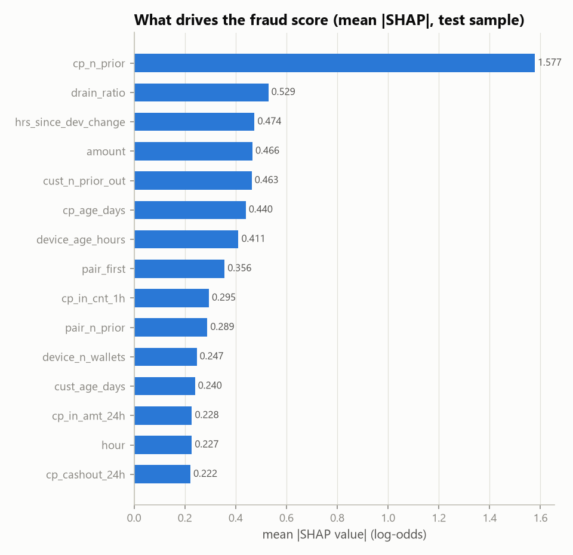

# Test-window evaluation (days 51-60, never used for training or tuning)

## Model comparison
| model | pr_auc | roc_auc | recall_at_fpr_0p5 | recall_at_fpr_2 | precision_at_recall_50 |
|---|---|---|---|---|---|
| rules baseline | 0.188 | 0.896 | 0.2003 | 0.3836 | 0.1242 |
| logistic regression | 0.8986 | 0.9974 | 0.9237 | 0.97 | 0.9545 |
| XGBoost | 0.9614 | 0.9978 | 0.955 | 0.9796 | 1.0 |
| LightGBM | 0.9622 | 0.9985 | 0.9496 | 0.9809 | 1.0 |
| Isolation Forest | 0.4052 | 0.8863 | 0.391 | 0.5204 | 0.2593 |
| graph rules | 0.1419 | 0.7877 | 0.2006 | 0.3383 | 0.0362 |
| Prohori fused score | 0.9622 | 0.9985 | 0.9496 | 0.9809 | 1.0 |



## Decision policy (bands)
```
{
 "NUDGE+": {
  "alerts": 1551,
  "tp": 715,
  "fp": 836,
  "precision": 0.461,
  "recall": 0.9741,
  "fpr": 0.01276
 },
 "STEP_UP+": {
  "alerts": 975,
  "tp": 697,
  "fp": 278,
  "precision": 0.7149,
  "recall": 0.9496,
  "fpr": 0.00424
 },
 "HOLD+": {
  "alerts": 775,
  "tp": 673,
  "fp": 102,
  "precision": 0.8684,
  "recall": 0.9169,
  "fpr": 0.00156
 },
 "band_counts": {
  "ALLOW": 64683,
  "NUDGE": 576,
  "STEP_UP": 200,
  "HOLD": 775
 }
}
```


## Recall by scam type
| scenario | fraud_txns | cases | recall_nudge | recall_stepup | recall_hold | case_caught_stepup |
|---|---|---|---|---|---|---|
| S1 | 174 | 36 | 1.0 | 1.0 | 0.989 | 1.0 |
| S2 | 151 | 9 | 1.0 | 1.0 | 0.98 | 1.0 |
| S3 | 66 | 11 | 0.985 | 0.985 | 0.924 | 1.0 |
| S5 | 136 | 13 | 0.882 | 0.779 | 0.743 | 1.0 |
| S6 | 70 | 12 | 1.0 | 1.0 | 1.0 | 1.0 |
| S7 | 93 | 34 | 0.978 | 0.935 | 0.849 | 0.971 |
| S8 | 44 | 7 | 1.0 | 1.0 | 0.955 | 1.0 |



## Recall by role in the scam
| fraud_role | n | recall_nudge | recall_stepup | recall_hold |
|---|---|---|---|---|
| buyer_payment | 93 | 0.828 | 0.688 | 0.634 |
| card_add_money | 20 | 1.0 | 1.0 | 1.0 |
| cashout | 8 | 1.0 | 1.0 | 1.0 |
| coerced_send | 37 | 0.973 | 0.865 | 0.676 |
| collector_cashout | 19 | 1.0 | 1.0 | 1.0 |
| mule_cashout | 180 | 1.0 | 1.0 | 1.0 |
| mule_hop | 76 | 0.987 | 0.987 | 0.868 |
| recipient_cashout | 38 | 0.974 | 0.974 | 0.974 |
| seller_cashout | 43 | 1.0 | 0.977 | 0.977 |
| takeover_drain | 102 | 1.0 | 1.0 | 1.0 |
| victim_payment | 118 | 1.0 | 1.0 | 0.975 |

## Customer impact (assumption-based estimate)
- Victim-side scam transactions in test: **370**; flagged STEP_UP or higher: **90.8%** (NUDGE or higher 95.4%).
- Victim money at risk: Tk 2,526,620; expected prevented with stop rates {'ALLOW': 0.0, 'NUDGE': 0.3, 'STEP_UP': 0.7, 'HOLD': 1.0}: **Tk 2,401,775 (95.1%)**.
- Scam cases with at least one STEP_UP+ intervention: 99.2% of 121.

## Friction for honest customers
- Legit customers active in test: 10,292; ever nudged 7.34%, ever asked to step up 2.59%, ever held 0.95%.
- Alerts per day: {'HOLD': 77.5, 'STEP_UP': 20.0, 'NUDGE': 57.6}. Analyst time for HOLD cases: 258.3 h manual vs 38.8 h with the copilot (assumed {'manual': 20, 'with_copilot': 3} minutes per case).

## Fairness
Groups with >= 1,000 legit transactions whose false-positive rate is > 1.25x the overall rate:
| attribute | group | legit_txns | fpr_nudge | fpr_nudge_ratio | fpr_stepup_ratio |
|---|---|---|---|---|---|
| age_band | 45-59 | 10669 | 0.01697 | 1.33 | 1.28 |
| age_band | 60+ | 3134 | 0.01436 | 1.12 | 1.65 |
| segment | farmer_rural | 3183 | 0.02545 | 1.99 | 2.22 |
| segment | small_business | 13022 | 0.01636 | 1.28 | 1.57 |
| kyc_level | KYC1 | 13489 | 0.01564 | 1.23 | 1.34 |

Full table: `fairness.csv`. 

## Ablation
| variant | pr_auc | recall_at_fpr_0p5 |
|---|---|---|
| full model | 0.9622 | 0.9496 |
| without transaction | 0.9553 | 0.9441 |
| without behaviour | 0.9361 | 0.9305 |
| without device_session | 0.9596 | 0.9619 |
| without flow | 0.9597 | 0.9496 |
| without counterparty | 0.8248 | 0.7916 |
| without agent | 0.959 | 0.951 |
| without complaints | 0.9458 | 0.9319 |
| without graph | 0.9641 | 0.9564 |

| variant | pr_auc | recall_at_fpr_0p5 |
|---|---|---|
| LightGBM only | 0.9622 | 0.9496 |
| LightGBM + IsolationForest | 0.9622 | 0.9496 |
| LightGBM + graph rules | 0.9622 | 0.9496 |
| fused (all three) | 0.9622 | 0.9496 |



## Explainability
Top features by mean |SHAP| on a test sample:

| feature | mean_abs_shap |
|---|---|
| cp_n_prior | 1.5775 |
| drain_ratio | 0.5288 |
| hrs_since_dev_change | 0.4742 |
| amount | 0.4662 |
| cust_n_prior_out | 0.4631 |
| cp_age_days | 0.4399 |
| device_age_hours | 0.411 |
| pair_first | 0.3565 |
| cp_in_cnt_1h | 0.2947 |
| pair_n_prior | 0.2886 |
| device_n_wallets | 0.2466 |
| cust_age_days | 0.2399 |
| cp_in_amt_24h | 0.2277 |
| hour | 0.2274 |
| cp_cashout_24h | 0.2219 |
| cp_out_cnt_24h | 0.2208 |
| hour_surprise | 0.2059 |
| f_type | 0.1982 |
| log_amount | 0.1935 |
| cp_woke_gap_days | 0.1854 |



Planted demo scenarios: see `demo_scenarios.md`.

> Synthetic data with injected patterns: treat these as upper bounds. Real upay data will be noisier, and the honest comparison is the gap over the rules baseline and per-scenario recall, not the absolute PR-AUC.